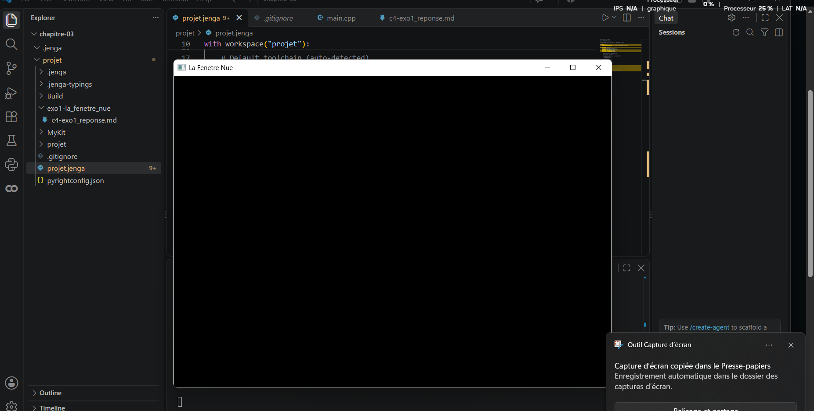

# Exercice 1 : La fenêtre nue


## Solution
Pour réaliser cet exercice, j'ai créé le projet `MaFenetre` avec Jenga et utilisé le kit `KitNkentseu`. Les modules `NKWindow` et `NKEvent` ont été utilisés pour créer la fenêtre et gérer les événements.

Le programme crée une fenêtre appelée **« Ma salle »**, avec une largeur de **1280 pixels** et une hauteur de **720 pixels**. Il vérifie ensuite que la fenêtre est valide. Tant que la fenêtre est ouverte, les événements sont traités avec `NkEvents().PollEvents()`.

### Programme [`main.cpp`](main.cpp)

```cpp
 nkentseu::NkWindowConfig config;
    config.title = "Ma Salle";
    config.width = 1000;
    config.height = 720;

    nkentseu::NkWindow fenetre(config);
    if (!fenetre.IsValid()) {
        return 1;
    }

    while(fenetre.IsOpen()) {
        nkentseu::NkEvents().PollEvents();
    }


```

### Fichier [`salle.jenga`](salle.jenga)

Le projet `MaFenetre` est configuré avec le kit `KitNkentseu` :

```python
from Jenga import *
from Jenga.GlobalToolchains import RegisterJengaGlobalToolchains

with workspace("projet"):
    RegisterJengaGlobalToolchains()
    useconfig("MyKit/Nkentseukit.jenga")
    configurations(['Debug', 'Release'])
    targetoses([TargetOS.WINDOWS])
    targetarchs([TargetArch.X86_64])
    
    # Default toolchain (auto-detected)
    # usetoolchain("host-gcc")
    
    # Uncomment to use Unitest testing framework
    # with unitest() as u:
    #     u.Precompiled()
    
    # Add your projects here
    # with project("MyApp"):
    #     consoleapp()
    #     language("C++")
    #     files(["src/**.cpp"])

    # Project: projet
    with project("projet"):
        consoleapp()
        language("C++")
        cppdialect("C++17")
        location("projet")
        files(["src/**.cpp", "include/**.hpp"])
        usenkentseukit()
```

### Construction et lancement
J'ai construit le programme avec la commande :
```powershell
jenga build
```

La compilation s'est terminée avec succès, puis j'ai lancé le programme et vérifié que la fenêtre **« Ma salle »** s'affiche correctement.

### Capture de la fenêtre



### Temps réalisé

**Temps de codage : environs 36 min 26 s.**
Pour mesurer le temps nécessaire à l'écriture du `main.cpp`, j'ai estimer le temps mis a l'installation et au build de Nkenseu de mercredi soir a 21h et 41 min et je me suis arreter a 4h defaut de connexion puis jai repris au campus a 13h 40 avec l'aide de mes camarades et pou terminer 16h 56min. don le temps estimer est de 9h 16min.


