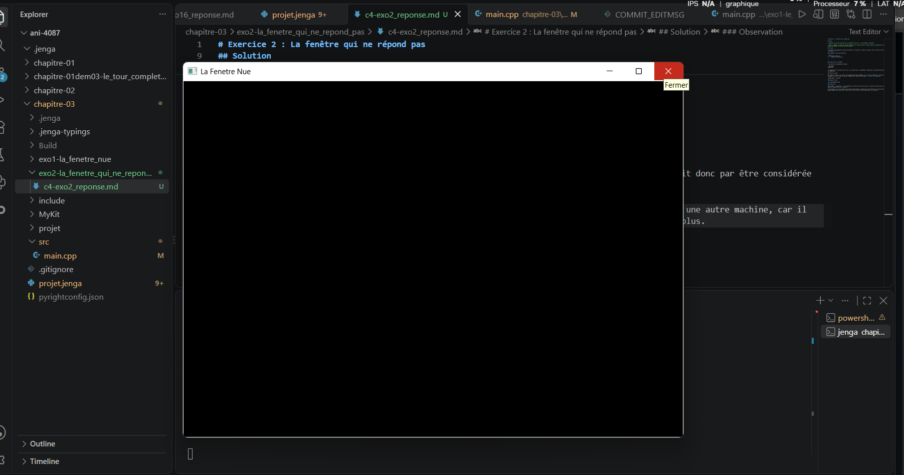

# Exercice 2 : La fenêtre qui ne répond pas


## Solution

J'ai duppliquer le code dans mon fichier main.cpp et par la suite j'ai mis en commentaire le premier code pour ne pas a avoir a le supprimer. Et par la suite j'ai modifié le corps de la boucle `while` afin de ne plus appeler `PollEvents()`.

### Programme [`main.cpp`](main.cpp)

```cpp
while (fenetre.IsOpen()){
    // NkEvents().PollEvents();
}

```

### Construction et lancement

J'ai construit le programme avec Jenga :

```powershell
jenga build
```

La compilation s'est terminée avec succès (0.00s)pou une premiere fois et (0.01s) lors de le deuxieme tentative de build. J'ai ensuite lancé le programme et attendu que le système détecte que la fenêtre ne répond plus.

### Mesure du temps

pour la mesure de mon temp, j'ai utiliser mon telephone en lancant le chronometre au momoent ou j'ai valide la commande "jenga run" ce qui ma pris "2.04 s"au moment de l'ouverture de ma fenetre.

**Temps mesuré est de: 2.04 s**

### Capture d'écran



### Observation

Sans l'appel à `PollEvents()`, les événements de la fenêtre ne sont plus traités. La fenêtre finit donc par être considérée comme ne répondant plus par le système.
